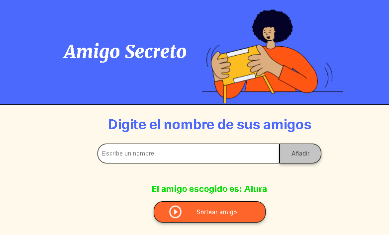

# 🎁 Amigo Secreto

¡Bienvenido a **Amigo Secreto**! Un divertido y sencillo proyecto para sortear un amigo secreto de manera rápida y sin complicaciones. 🎉

---

## 📜 Descripción

Este proyecto te permite ingresar nombres de amigos y realizar un sorteo aleatorio para elegir a uno de ellos como el amigo secreto. 🏆

🔹 **Agrega nombres** en una lista interactiva.  
🔹 **Visualiza** los nombres ingresados en tiempo real.  
🔹 **Sortea un amigo secreto** con solo un clic.  
🔹 **Interfaz intuitiva y fácil de usar**.  

---

## 🚀 Captura de pantalla



---

## 🎥 Demostración en video

[](https://www.youtube.com/watch?v=VIDEO_ID)

---

## 🛠️ Tecnologías utilizadas

- HTML5
- CSS3
- JavaScript (DOM Manipulation)
- Google Fonts

---

## 📂 Estructura del proyecto

```
📦 AmigoSecreto
├── 📄 index.html        # Estructura principal de la página
├── 🎨 style.css         # Estilos y diseño de la interfaz
├── 🚀 app.js           # Lógica del sorteo y manipulación del DOM
├── 📂 assets           # Imágenes y recursos gráficos
│   ├── amigo-secreto.png
│   ├── play_circle_outline.png
│   ├── screenshot.png  # Captura de pantalla del proyecto
└── 📄 README.md        # Documentación del proyecto
```

---

## 🎯 Cómo usar el proyecto

1️⃣ Clona este repositorio:
```sh
  git clone https://github.com/Boristar/AmigoSecreto.git
```

2️⃣ Abre el archivo `index.html` en tu navegador favorito.  
3️⃣ Ingresa nombres en el campo de texto y agrégalos a la lista.  
4️⃣ Presiona el botón "Sortear amigo" y descubre al elegido. 🎲

---

## 📢 Contribuciones

¿Tienes ideas para mejorar el proyecto? ¡Las contribuciones son bienvenidas! 🎊 
Puedes hacer un **fork**, mejorar el código y enviar un **pull request**.

---

## 📧 Contacto

Si tienes alguna pregunta o sugerencia, no dudes en escribirme a 📩 **mypersonalteacher@gmail.com**  
¡Gracias por visitar este proyecto! 💖
